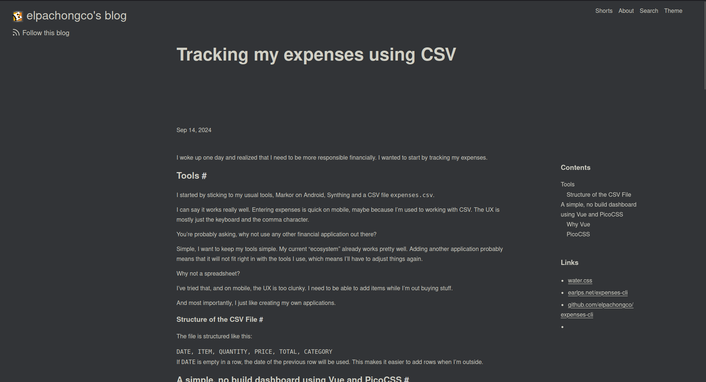
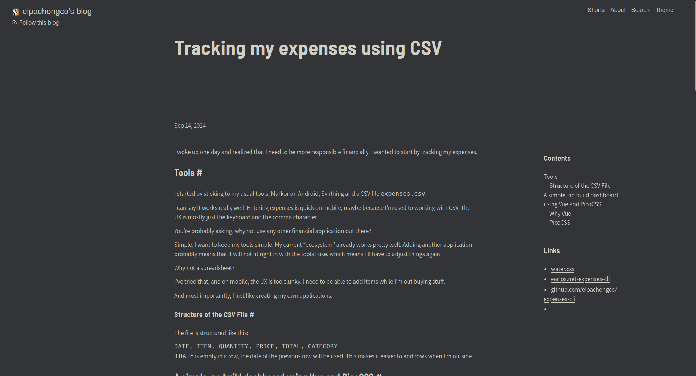

I realized that my website's article view looks weird. Here's the screenshot:

There are a few things that can be improved here but I recently realized how important visual hierarchy is to a design.

The problem here is, there's no one element that particularly stands out when the page is viewed. The user will either look at the logo or the title. This is a bit weird as we always want to point the user to where we want them to look - that's the job of the design.

The first step was to decide which element I want the user to look at upon opening the page. I decided that the title is the one they should be looking at.

So the next step is to make the title stand out. How? By adding contrast.

Currently the contrast between the size of the site's name and the title is too narrow. The contrast can be expanded by making the two elements different enough.

Here's the final output:

There are a lot of changes here but the ones notable for improving visual hierarchy is:

1.  Smaller site badge size - this shaves off the emphasis to the site badge which makes the title more noticeable.
2. Change in the size of the title's font size - the bigger font size increased the title's contrast against its surrounding elements.
3. A new font of the title - I chose a font that looks a bit thicker than the previous one. It is a semi-condensed font in semi-bold style. I felt like the condensed design of the font improved its contrast versus the previous font.

That's it. I've removed the weirdness of the design by adding more contrast to elements and helping the user's eye to focus on one element.
