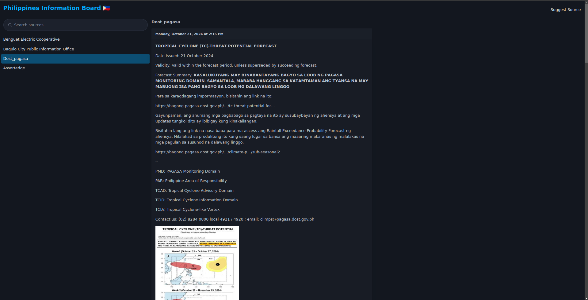

I made a website that scrapes the posts of local Facebook pages.

I did this because I'm forced to open Facebook when checking for local news. I published a [rant](https://earlps.net/post/2024-09-29-facebook/) about this.

I'm currently collecting posts of 4 specific pages but I'm planning to add more. The pages I've added are the ones I almost always look which is limited to my region. I plan to include pages relevant in the other regions of the Philippines so I've added a link to a Google Form for suggesting new pages to add. 

I'm strictly limiting this to the Philippines but if you're interested in hosting the same service locally, it's very easy to do, and I've set up the code to be easy to modify.

The backend code is in Django, frontend in Vue options, and PicoCSS. It's very simple. Check it out: [filinfo.earlps.net](https://filinfo.earlps.net)

Screenshot:

